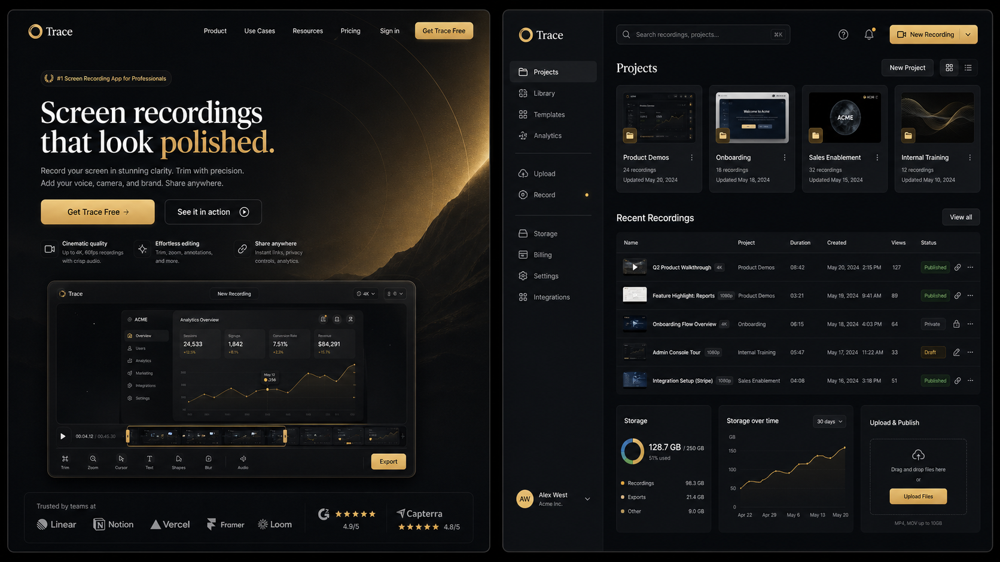

# <p align="center">Trace</p>

<p align="center"><strong>Trace is an open-source tool for creating polished screen recordings, product demos, and walkthroughs.</strong></p>

Trace is a professional screen recording and editing app for macOS, Windows, and Linux. Record your screen, webcam, and audio — then edit, caption, and export in minutes. AI-powered auto-zoom, on-device captions, cursor effects, and more, all processed locally.

> Use it, modify it, distribute it. Please respect the license.

<p align="center">
  
  
</p>

## Core Features

- **Record** a specific window, or your whole screen.
- **Audio** — Record microphone and system audio simultaneously.
- **Webcam overlay** — Picture-in-picture, drag-to-position, mirroring, and shape options.
- **Auto-zoom** — Follows your cursor as you work, with adjustable depth, duration, easing, and pixel-precise positioning.
- **Cursor effects** — Custom size, smoothing, click effects, themes, and post-recording path smoothing.
- **AI captions** — Automatic voiceover captions generated on-device (works offline, no upload).
- **Backgrounds** — Wallpapers, solid colors, gradients, or your own image.
- **Motion blur** — Smooth, natural-looking movement.
- **Video editor** — Timeline with crop, trim, per-segment speed control, snapping guides, and audio waveform.
- **Annotations** — Text, arrow, and image overlays with text animation presets.
- **Custom shortcuts** — Fully customizable keyboard shortcuts.
- **Export** — MP4 or GIF, multiple aspect ratios and resolutions.
- **Localized** — Arabic, English, Spanish, French, Italian, Japanese, Korean, Portuguese (Brazil), Russian, Turkish, Vietnamese, Simplified Chinese, and Traditional Chinese.

## Installation

### macOS

**Mac App Store** (recommended): Search for "Trace" on the Mac App Store.

**Direct download**: Download the latest `.dmg` from the [GitHub Releases](https://github.com/drewsephski/trace/releases) page.

> [!NOTE]
> **Upgrading from an older version and hitting permission issues?** If you already had Trace installed and the new version won't record (Screen Recording or Accessibility keep failing even after you grant them), uninstall the old version, remove Trace's existing entries under **System Settings > Privacy & Security** (both Screen Recording and Accessibility), then do a fresh install and grant the permissions again when prompted.

### Windows

Download the `.exe` installer directly from the [Releases page](https://github.com/drewsephski/trace/releases).

### Linux

Three packages are published to the [Releases page](https://github.com/drewsephski/trace/releases) for each version. Pick the one that matches your distro:

**Debian / Ubuntu / Pop!_OS (`.deb`)**
```bash
sudo apt install ./Trace-Linux-latest.deb
```

**Arch / Manjaro (`.pacman`)**
```bash
sudo pacman -U Trace-Linux-latest.pacman
```

**Any distro (`.AppImage`)**
```bash
chmod +x Trace-Linux-*.AppImage
./Trace-Linux-*.AppImage
```

**NixOS / Nix (flake)**

Try without installing:
```bash
nix run github:drewsephski/trace
```

Install into your user profile:
```bash
nix profile install github:drewsephski/trace
```

For a NixOS system config (flake):
```nix
{
  inputs.trace.url = "github:drewsephski/trace";

  outputs = { nixpkgs, trace, ... }: {
    nixosConfigurations.<host> = nixpkgs.lib.nixosSystem {
      modules = [
        trace.nixosModules.default
        { programs.trace.enable = true; }
      ];
    };
  };
}
```

For Home Manager, use `trace.homeManagerModules.default` with the same `programs.trace.enable = true;`.

You may need to grant screen recording permissions depending on your desktop environment.

**Sandbox error:** If the AppImage fails to launch with a "sandbox" error, run it with `--no-sandbox`:
```bash
./Trace-Linux-*.AppImage --no-sandbox
```

## Platform Differences

Everything in the editor and export is the same on macOS, Windows, and Linux: zooms, backgrounds, motion blur, crop/trim/speed, blur regions, annotations, auto-captions, projects, export, and all languages. The differences are in **capture**, where macOS and Windows use a native pipeline that Linux doesn't have:

- **Native recording**: macOS (ScreenCaptureKit) and Windows (Windows Graphics Capture) record through a native pipeline for higher quality and clean window-level capture. Linux records through the browser pipeline instead.
- **Custom cursors**: on macOS and Windows the real cursor is captured (shape, type, and clicks), which powers the cursor themes, click effects, and editable cursor overlay. On Linux only the cursor position is captured (used for auto-zoom), so those cursor options aren't available.
- **Webcam**: captured natively on macOS and Windows; on Linux it's recorded through the browser, but still works as a picture-in-picture overlay.
- **System audio** support varies by OS:
  - **macOS**: requires macOS 13+. On macOS 14.2+ you'll be prompted to grant audio capture permission. macOS 12 and below can't capture system audio (mic still works).
  - **Windows**: works out of the box.
  - **Linux**: needs PipeWire (default on Ubuntu 22.04+, Fedora 34+). Older PulseAudio-only setups may not capture system audio (mic should still work).

## Building from Source

Prerequisites: Node.js 22, npm.

```bash
npm ci
npm run build:mac   # macOS
npm run build:win   # Windows
npm run build:linux # Linux
```

For Mac App Store builds:
```bash
npm run build:native:mac
tsc && vite build
electron-builder --mas
```

## Contributing

See [CONTRIBUTING.md](./CONTRIBUTING.md).

## Changelog

### v1.5.0 — June 2026

- Rebrand from OpenScreen to Trace
- CI pipeline for automated builds and releases
- Native macOS ScreenCaptureKit recording helper
- Native Windows WGC recording helper
- AI auto-zoom with cursor tracking
- On-device AI captions (works offline)
- Webcam overlay with PiP, mirroring, shapes
- Custom cursor effects with themes and smoothing
- Full video editor with timeline, trim, speed control, annotations
- GIF and MP4 export
- 13 language translations
- Project save/load with persistence

## License

This project is licensed under the [MIT License](./LICENSE). By using this software, you agree that the authors are not liable for any issues, damages, or claims arising from its use.
